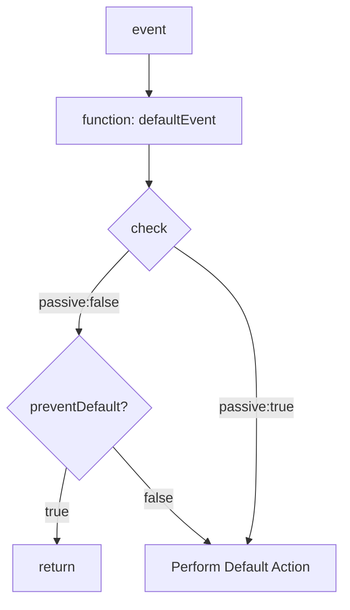

# Passive Event Listeners in JavaScript

## What are passive event listeners?

Passive event listeners are event listeners added using the [`addEventListener`](https://developer.mozilla.org/en-US/docs/Web/API/EventTarget/addEventListener#using_passive_listeners) method with a `{ passive: true }` option. This option tells the browser that this event listener will not affect the browser's default response.

## Why should we use passive event listeners?

Passive event listeners come with performance benefits that can improve the responsiveness of your site. In the case of an [event](https://developer.mozilla.org/en-US/docs/Web/API/Event), such as a scroll, the browser knows how to handle this [event](https://developer.mozilla.org/en-US/docs/Web/API/Event) by default but does not know if your JavaScript code is calling [`preventDefault()`](https://developer.mozilla.org/en-US/docs/Web/API/Event/preventDefault) and overriding this default behavior.

To ensure that an event is handled in the default way, the browser needs to check all the event listeners and ensure that none of them are overriding or interfering with the default action.

This process of checking can take a considerable amount of time if there are too many event listeners and can result in a *janky* experience for users.

Passive event listeners guarantee that they will not override or interfere with the default browser action, making it safe for the browser to skip checks for them. This results in a smoother experience for users.




The diagram above depicts the control flow of an event listener and how it may change if the listener is set to `passive`.

## Lighthouse Score Benefits

Scrolling is one of the [type of events](https://developer.mozilla.org/en-US/docs/Web/Events) where using passive event listeners can make a big impact on your site's performance. Users are likely to experience significant delays if your listeners are targeting this event and require a considerable amount of time to execute. Check out this example on [MDN Playground](https://developer.mozilla.org/en-US/play) to see the difference.

Lighthouse suggests adding the `passive` flag to every event listener it identifies in the performance audit. This can be used as an effective way to determine which listeners should be passive if you are not 100% sure.

Again, with every automated technology, please use your HI (human intelligence) as well to make the best decision possible.

[Check out Lighthouse best practices](https://developer.chrome.com/docs/lighthouse/best-practices/uses-passive-event-listeners).

## How to use passive event listeners?

Using passive event listeners is simple. The `addEventListener(type, listener, options)` method accepts an options object as its third argument.

You can pass `{passive:true}` as the third argument to your event listener like this:

```js
someElement.addEventListener(
  "mouseup",
  handleMouseUp,
  { passive: true }
);
```

This will make your event listener passive!

### When *NOT* to use passive event listeners?

Most listeners can be passive but in situations where your event listener is overriding/modifying browsers default action you should *NOT* use passive event listener.

Hence, in situations where your listener needs to override or change browser action, consider setting `passive` option to false.

## Examples

1. Shrinking Navbar on Scroll

When user scrolls down `80px` from the top of the DOM, resize navbar's padding and logo size.


### Legacy way of scripting this functionality

```js
window.onscroll = function() {if(screen.width>1280){scrollFunction()}};

function scrollFunction() {
    if (document.body.scrollTop > 80 || document.documentElement.scrollTop > 80) {
      // document.getElementById("secondaryNav").style.maxHeight = "0px";
      document.getElementById("secondaryNav").style.transform = "translateY(-35px)";
      document.getElementById("secondaryNav").style.visibility = "hidden";
      document.getElementById("navbar").style.height = "85px";
      document.getElementById("navbar").style.paddingTop = "0px";
      
    } else {
      // document.getElementById("secondaryNav").style.maxHeight = "40px";
      document.getElementById("secondaryNav").style.transform = "translateY(0px)";
      document.getElementById("secondaryNav").style.visibility = "visible";
      document.getElementById("navbar").style.height = "120px";
      document.getElementById("navbar").style.paddingTop = "35px";
    }
  }
```

### Improving this with passive event listeners

```js
document.addEventListener('scroll', () => {
	if(screen.width > 1280) {
		scrollFunction();
	}
}, {passive:true});

function scrollFunction() {
    if (document.body.scrollTop > 80 || document.documentElement.scrollTop > 80) {
      // document.getElementById("secondaryNav").style.maxHeight = "0px";
      document.getElementById("secondaryNav").style.transform = "translateY(-35px)";
      document.getElementById("secondaryNav").style.visibility = "hidden";
      document.getElementById("navbar").style.height = "85px";
      document.getElementById("navbar").style.paddingTop = "0px";
      
    } else {
      // document.getElementById("secondaryNav").style.maxHeight = "40px";
      document.getElementById("secondaryNav").style.transform = "translateY(0px)";
      document.getElementById("secondaryNav").style.visibility = "visible";
      document.getElementById("navbar").style.height = "120px";
      document.getElementById("navbar").style.paddingTop = "35px";
    }
  }
```

