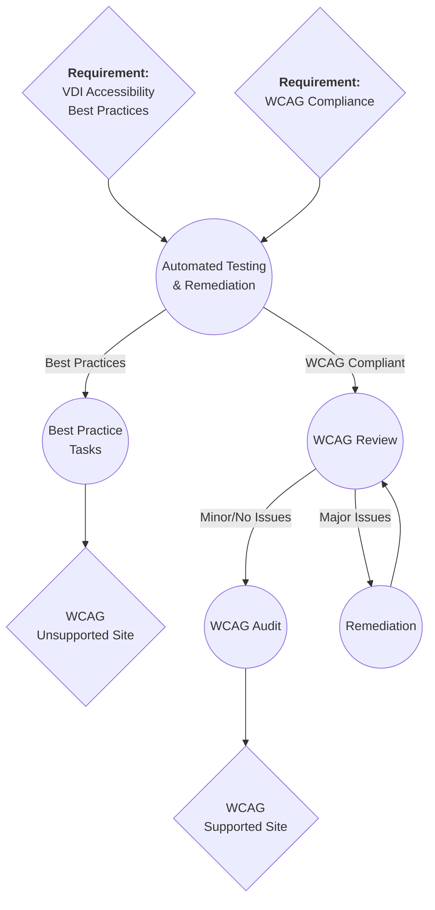

{: .note }
This is a living document subject to change as this process is currently a work in progress.

## Accessibility QA

{: .no_toc }

  

    Table of contents
  

  {: .text-delta }
1. TOC
{:toc}

## [Developer resources document](https://docs.google.com/document/d/1p6WbuM26EDt5N3msgGyJZjhi2o2NzzUhQrJwahsXYgg/edit?usp=sharing)

## Workflow

There are two main streams of Accessibility QA processes:

1. Generic VDI Best Practices
2. A WCAG compliant website

To find out where your project falls, log into ActiveCollab, navigate to your project, and check in the Notes section for project scope. You will be able to find (Ctrl + F) "WCAG" somewhere in the scope if it needs to be WCAG Compliant. If it's not, then it falls to category #1, Generic VDI Best Practices.

## ❶ Automated Testing & Remediation

For:
VDI Best Practices
WCAG Compliance

Automated testing is a great first step since it helps to make manual testing more efficient. For both workflows you will start here.

[Review automated testing protocol](/docs/processes/accessibility-automated-testing.html){: .btn .btn-outline }

## ❷ Best Practices

For:
VDI Best Practices

When a website does not need to meet a specific WCAG level of compliance, we still want to do our best. This subset of criterion from WCAG Version 2.2 have been selected based on the following factors:

- **How often they come up in website designs.** Some criterion cover very specific features we infrequently encounter. These have been removed in order to create a shorter list.
- **How complex a criterion is to understand.** Some are difficult to understand and have been removed.
- **Its impact on usability.** Certain criterion tackle issues that would leave a website completely unusable to a certain audience if not followed.

[Review progress checklist](/docs/processes/accessibility-progress-checklist.html){: .btn .btn-outline }

## ❷ WCAG Review & Remediation

For:
WCAG Compliance

{: .note }
Please make sure you have completed automated testing before moving on to this stage.

The WCAG Review & Remediation process can be quick, or it can be a long repetitive process. It can iterate on itself as many times as needed until there are little to no issues found during basic reviews. From here, a full WCAG Audit can be completed.

### How to Review

You can review a website for general WCAG compliance (and general best practices) yourself up to a certain extent. The following testing can be completed by anyone. You can remediate any issues you are confident with, or, simply note them to go over with someone else to confirm if they necessitate remediation.

- [Keyboard Testing](/docs/processes/accessibility-keyboard-testing.html)
- [Colour Contrast Testing](/docs/processes/accessibility-contrast-testing.html)

[Review progress checklist](/docs/processes/accessibility-progress-checklist.html){: .btn .btn-outline }

## ❸ WCAG Audit/Compliance Testing

For:
WCAG Compliance

A thorough and detailed WCAG audit, using the level and version that the contract specifies, is the final step before moving onto any other provincially mandated accessibility tasks.

When this audit is completed, it can be used to inform an ACR, or, other documentation that needs to be submitted to governments or other organizations. We have a report template we can use for **informal** reporting to provide to clients.

[Report Template](https://docs.google.com/document/d/1_iEpFhfONF3nycUl3KLrSO7Ax8lZybe0g-zyZTmvoO0/edit?usp=sharing)

This step should be completed by someone confident in their auditing skills across all WCAG criterion and can produce an ACR if required. Someone IAAP certified, or has measurable experience in web accessibility auditing (specifically auditing, not just remediation or accessibility knowledge for their field of work) will be best.

It will also be helpful to receive an itemized list of all issues found and how to remediate them instead of only an audit marking what is supported and not supported.

Some providers:

- [Accessibility Canada Website Audits](https://accessibilitycanada.ca/website-audits/)
- [Accessible Web WCAG Accessibility Audits](https://accessibleweb.com/services/wcag-accessibility-audits/)
- [Deque Compliance Testing Services](https://www.deque.com/services/audits-compliance-testing/)
- [Equalize Digital Website Accessibility Audit](https://equalizedigital.com/services/website-accessibility-audit/)
