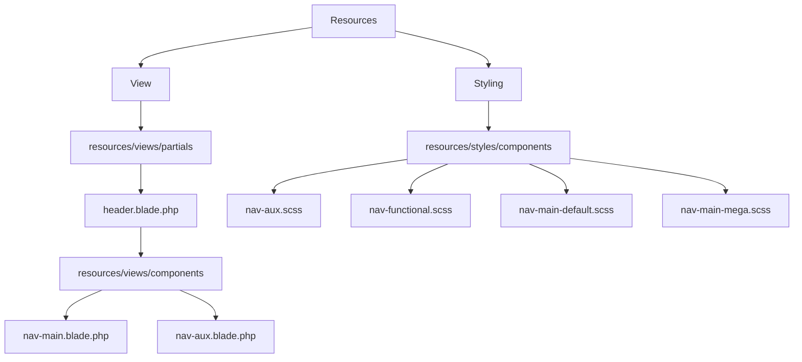
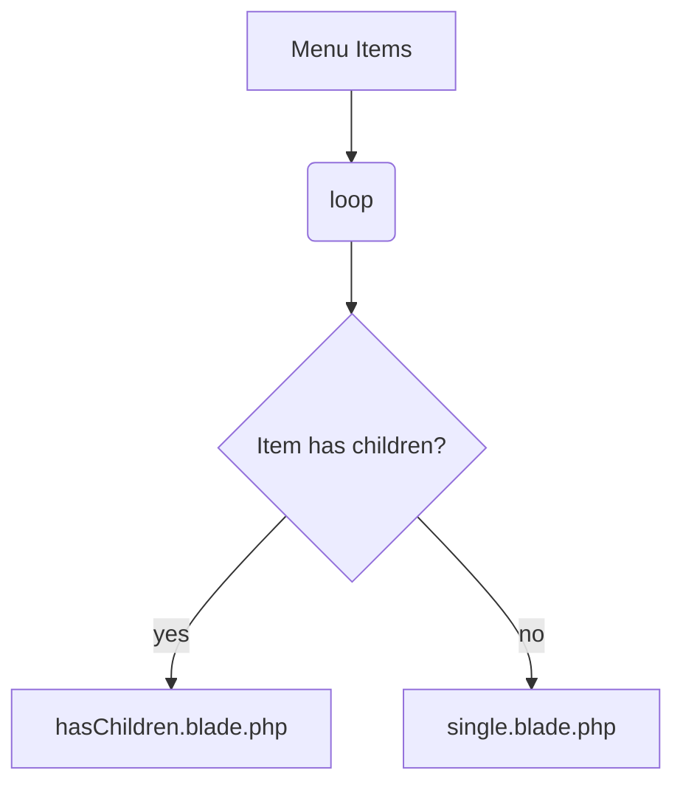
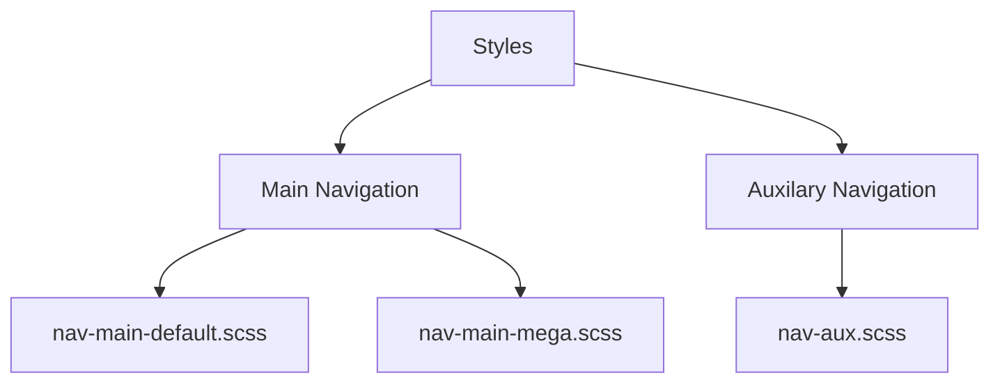

# Navigation: Anatomy
{: .no_toc }

  

    Table of contents
  

  {: .text-delta }
1. TOC
{:toc}

## File Structure Explained

## Markup

### Website Header

- `views/partials/header.blade.php`
    - File contains the markup for the main website header as a whole. Calls in our actual navigation component using `<x-nav-main />` and `<x-nav-aux />`.

### Nav elements inside the website header

- `views/components/nav-main.blade.php` 
    - File contains the markup responsible for rendering the `<nav class="nav-main"...` element.
    - Uses the `<x-nav-main__toggle>` component to pull in the hamburger menu button for mobile.
    - Uses the `<x-menu-items menu-name="main_navigation">` component to pull in our menu items for the WordPress menu: Main Navigation.
        - `views/components/nav-main__toggle.blade.php`
            - File contains the markup for mobile menu’s hamburger icon. This is a SVG file for now and will be move to blade icons once we finish the icons implementation.
- `views/components/nav-aux.blade.php`
    - File contains the markup responsible for rendering the `<nav class="nav-aux"...` element.
    - Uses the `<x-menu-items menu-name="aux_navigation">` component to pull in our menu items for the WordPress menu: Auxiliary Navigation.
    - Has additional markup and includes for other features like social media, and global search.

### Menu Items inside nav element

- `views/components/menu-items/` 
    - Folder contains the markup for *unordered* list and list elements (li tags) containing menu-items.
    - `views/components/menu-items/index.blade.php` 
        - File contains the markup for unordered list.
    - `views/components/menu-items/single.blade.php`
        - File contains markup for list elements which handle lone menu-items, i.e, menu-items that **do not** have any nested items.
    - `views/components/menu-items/has-children.blade.php`
        - File contains markup for list elements which handle parent menu-item which have nested menu-items.

## Styles

- `/styles/components/indes.scss`
    - File imports the sass partials as-needed
- `/styles/components/nav-functional.scss`
    - File contains all the required styles to:
        - Make the functionality written in the JavaScript to work as intended.
        - To provide required accessibility considerations (you *can* write your own if they are sufficient, but you must consider all WCAG criteria before removing these).
- `/styles/components/nav-main-default.scss`
    - File with basic styles for:
        - Horizontal right aligned desktop navigation, and hamburger mobile navigation.
        - Stacked single-column desktop and mobile submenu.
    - You will need to add to this file to match the designs provided to you.
- `/styles/components/nav-main-mega.scss`
    - File with basic styles for:
        - Horizontal right aligned desktop navigation, and hamburger mobile navigation.
        - “Mega Menu” submenus (separate lists with “headings”) for desktop and mobile.
    - You will need to add to this file to match the designs provided to you.
- `/styles/components/nav-aux.scss`
    - File with basic starter styles for auxiliary navigation.
    - You’ll likely need to heavily modify this to match the design provided to you.

## Scripts

- `/scripts/modules/NavMainToggle.js`
    - File to decide behaviour for `.nav-main`'s `#navMainToggle` button.
        - Setting the `aria-expanded` attribute between true and false when clicked (includes expected keyboard functionality).
            - Sets it to false when focus moves away.
        - As a secondary behaviour, whenever `aria-expanded` is toggled to false, it also toggles all `.menu-vdi__toggle`’s to false.
- `/scripts/modules/MenuDropdowns.js`
    - File to decide behaviour for all `.menu-vdi`'s `.menu-vdi__toggle` buttons.
        - Setting the `aria-expanded` attribute between true and false when clicked (includes expected keyboard functionality).
            - Sets it to false when focus moves away.
        - As a secondary behaviour, whenever `aria-expanded` is toggled to false, it also toggles `#navMainToggle` to false.
        - When the escape key is pressed, `.menu-vdi__toggle` buttons and `#navMainToggle` button has `aria-expanded` set to false.