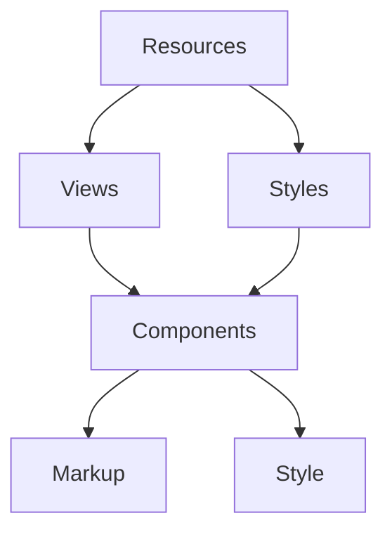

# Navigation: Component
{: .no_toc }

  

    Table of contents
  

  {: .text-delta }
1. TOC
{:toc}

## Quick Start Guide

Starter Theme 3 implements navigation as multiple [blade components](https://laravel.com/docs/11.x/blade#components).  

**To quickly get up and running:** 

1. Set the menu-name attribute (currently “main_navigation”) in `resources/views/components/nav-main.blade.php` to the name of your menu, and see the navigation come to life!
2. Optionally, if you are using the auxiliary navigation, set the menu-name attribute (currently “aux_navigation”) in `resources/views/components/aux_navigation.blade.php` too.
3. Update the icon SVG/image in `resources/views/components/nav-main__toggle.blade.php` if needed.
4. Call the stylesheets you need in `resources/styles/components/index.scss`. Comment/uncomment what you don’t need/need.
    - You will *always* need `nav-functional`.

{: .note}
Note: The value of the `menu-name` attribute is the name of menu as defined in Wordpress backend under Appearances > Menus > Menu Structure. 

## What is a component?

A component is collection of logic, markup and styling.

### Logic

- Decides how the menu data returned from Wordpress is processed.
- You will seldom need to edit this file. This file is available for you to look at but there is no need to understand it in order to use the navigation component.
- Logic is stored in a component controller which is responsible for rendering the view files and making all the data available in the view file.

### Markup and styling

- How your navigation will look and function. You’d be working with blade files and .scss style sheets to build navigation according to your custom theme design.
- Markup files are under `resources/views/components`
- Styling files are under `resources/styles/components`

## Markup explained

Markup is the structural part of the view which consists of HTML. Default markup files contain accessible navigation structure that will work for most use cases. In case you update the markup files, please be sure to think about accessibility implications.

Overall, we make use of custom classes using the [BEM methodology](https://getbem.com/) instead of inline Tailwind classes. 

The [Accessible Navigation Markup page](/docs/starter-v3-enhancements/navigation/accessible-navigation-markup.html) will walk you through why things are written the way they are. This is not required reading.

## Styles explained

By default `nav-main-default.scss` is included in `resources/styles/components/index.scss`*.* If you need to use a “mega menu” style navigation with headings and columns, the implementation is as easy as swapping `nav-main-default` with `nav-main-mega` in the index file.

### Inline vs Stylesheets

Tailwind styles are applied inside the stylesheets using the [`@apply` directive](https://tailwindcss.com/docs/functions-and-directives#apply). This is done instead of inline Tailwind classes for a few reasons:

- **This approach allows us to hot-swap navigation style without making markup changes!**
- We can easily set a custom breakpoint value (currently 62.5rem (or 1000px)) for the navigation to switch between expanded/desktop andcollapsed/mobile.
    - This value should be updated per-project, when the desktop navigation becomes too squished to make sense to continue styling responsively.
- More refined Tailwind breakpoints can be written for responsive styling within your `@apply` Tailwind statements.
- Due to the complex nature of navigational markup structures, keeping the styles out of the blade files helps keep this navigation ecosystem more manageable long-term.

## Scripts explained

### Background/Context

Apart from markup, styling and logic, the component relies on some scripts that handle the dynamic dropdown toggle and such functionality.

The script files have some comments to explain what it’s doing at certain points, but generally you will not  need to be in here at all for the duration of your project.

The scripts files are to be restructured and more documentation on those will come soon!

### General

For simplicity-sake, we use the [`aria-expanded` attribute](https://developer.mozilla.org/en-US/docs/Web/Accessibility/ARIA/Attributes/aria-expanded) only, without the need for an additional class toggling to control visibility.

{: .note}
To further understand the anatomy of site header and navigation refer to [Anatomy of Navigation](/docs/starter-v3-enhancements/navigation/anatomy-of-navigation.html).

## Logic explained

The `menuItems.php` file is self documenting. If you need to make changes to the file, please refer to the inline comments.

The current implementation is expected to work for 90% of use cases, and so it is not recommended to make any changes to the logic. If you really need some custom behaviour, come chat with Aarish before you dig into the controller file.

{: .note}
In cases you make changes to the logic file, there is no guarantee that component will work as documented. In such cases you are in uncharted territory, sailor!

High level overview of component class to be written soon!